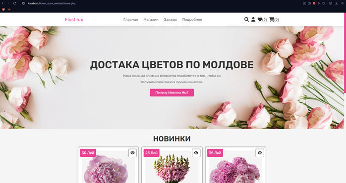
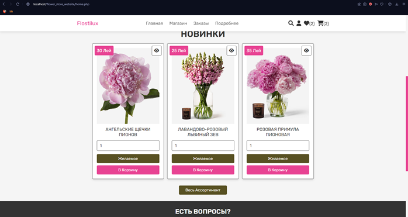
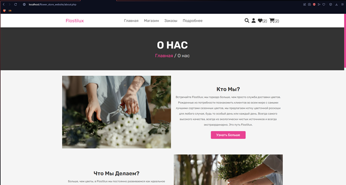
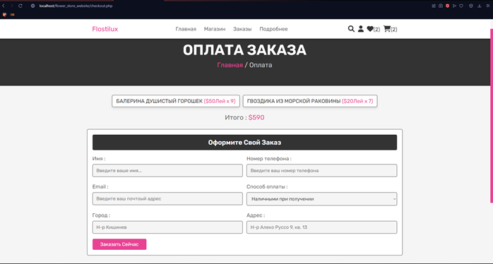
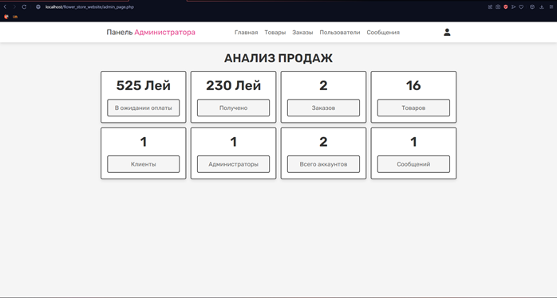

# Flower Shop

Welcome to Flostilux online flower shop, where you can explore a wide variety of fresh bouquets and floral accessories. 
The website is designed to provide a user-friendly experience, offering both user and administrative sections for seamless order tracking, budget management, and feedback.

# Author
## Daria Stanilevici
If you have any questions or suggestions, feel free to reach out to our team at dstanilevichi@gmail.com.

### Here are some pages:
 Home page 

 Flowers 

 About Us section 

 Payment page 

 Administration Section with reports 

# Features
### User-friendly interface: 
- The website is designed to be intuitive and visually appealing, providing a pleasant browsing experience.
- User and Administrative sections: I have implemented separate sections for users and administrators to ensure efficient management of orders, budget, and feedback.
- Order Tracking: Once registered, users can easily place orders and monitor their status.
- Product Purchase: Users have the option to purchase products directly from the website.
- Wish List: Users can save desired products to their wish list for future reference.
- Reviews and Feedback: Customers can leave reviews, helping us improve our services.
- Messaging System: Users can send messages to our team for inquiries, suggestions, or any other concerns.

# Technologies Used
- HTML: The website is built using HTML to create the structure and content of the web pages.
- JavaScript: I have utilized JavaScript to add interactivity and enhance the user experience.
- PHP: PHP is used for server-side scripting, handling user requests, and interacting with the database.
- phpMyAdmin: as our database management tool.

# Usage
- Register a new account on the website.
- Browse through collection of fresh bouquets and floral accessories.
- Add products to your cart and proceed to the checkout process.
- Monitor your order status in the user section.
- Leave reviews and provide feedback to help improve the services.
- Contact the team via the messaging system for any inquiries or suggestions.
