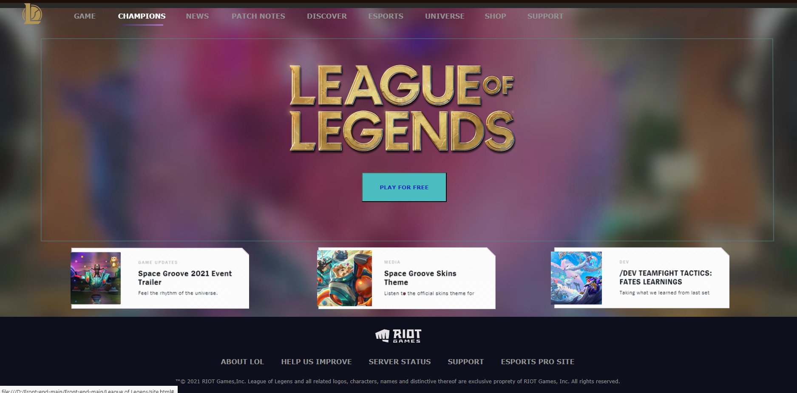

# League of Legends Website Copy

This project is a copy of the League of Legends website, aiming to recreate the design and functionality of the official website. 

# Author
## Daria Stanilevici
If you have any questions or suggestions, feel free to reach out to our team at dstanilevichi@gmail.com.

### Website overview:

# Technologies Used:
- HTML: The structure and content of the web pages are built using HTML.
- CSS: for styling and layout of the website, ensuring it matches the visual design of the original League of Legends website.
- JavaScript: to add interactivity, such as dynamic content loading and form validation.
